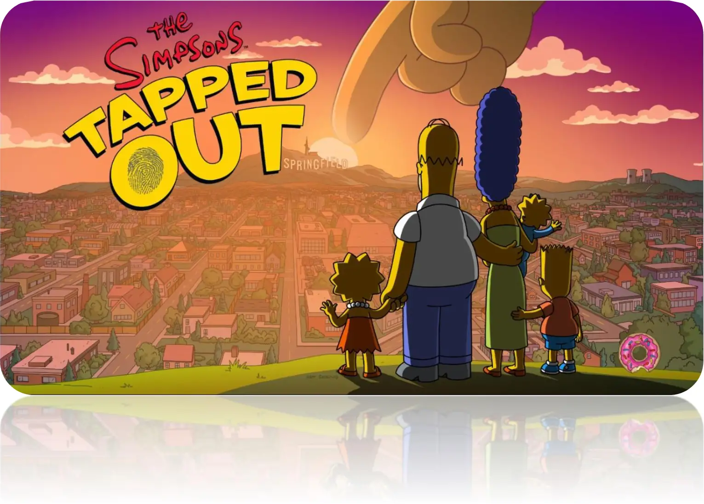

<figure>
  
  <figcaption><i>
"The nostalgic video game that we all thought we lost will continue as long as there are people with a love and a passion for playing." -r/TappedOut
</i></figcaption>
</figure>

# TSTO PRIVATE SERVER MANUAL
This is a step-by-step guide on how to patch the tsto.apk file and install the tsto private server.

## Compatibility:
   * WindowsOS | Linux | macOS | iOS

## Tutorial 
   * <b>Level:</b>
     * This guide is designed for individuals with minimal knowledge of the process. 
However, regardless of skill level, it can benefit anyone who wants to have all the necessary information in one place.
   * <b>Guide Base:</b>
      * WindowsOS
      * Bodnjenie14 Server

## What this Guide includes:
   * <b>Links to the Private Servers</b>
   * <b>Links to the Dependent Programs</b>
   * <b>Links to Articles, Videos, and additional resources</b>
   * <b>A user-friendly how-to guide (that includes screenshots)</b>
      * How to patch an apk
      * How to install a private server
   * <b>Common Error Messages with helpful solutions</b>

   ## Table of Contents
   * <b>The Simpson's Tapped Out:</b>
      * <a href="#tsto-private-server-options">TSTO Private Server Options</a>
   
   * <b>Programs:</b>
      * <a href="#programs-that-are-dependents">Programs that are Dependents</a>
      * <a href="#optional-programs">Optional Programs</a> 
      * <a href="#android-emulators--apk-installers">Android Emulators | APK installers</a>

   * <b>Tutorials:</b>
      * <a href="#how-to-install-python">How to install Python</a>
      * <a href="#how-to-install-jdk23">How to install JDK23</a> 
      * <a href="#how-to-install-7zip">How to install 7Zip</a>
      * <a href="#how-to-install-ffmpeg">How to install FFmpeg </a>
      * <a href="#how-to-install-chocolatey">How to install Chocolatey | Choco</a> 
      * <a href="#how-to-install-apkpure">How to install APKPure</a>
      * <a href="#how-to-install-apkmirror">How to install APKMirror</a>
      * <a href="#how-to-install-uptodown-apk-installer">How to install Uptodown APK installer</a> 
      * <a href="#how-to-install-apks-with-uptodown">How to install APK’s with Uptodown</a>
      * <a href="#how-to-install-bluestacks">How to install Bluestacks</a>
      * <a href="#how-to-check-if-virtualization-is-supportedenabled-on-your-pc">How to check Virtualization settings on PC</a> 
      * <a href="#how-to-install-nox-player">How to install Nox Player</a>

   * <b>Tutorials:</b>

 

      * 
      *  
      * 
      * 
      *  
      * 
      * 
      *  
      * 
---------------------------------------------------------------------------
 
 
 
 
 
 
 
 
 
 
 
 
 
 
 
 
 
 
 
 
 
 
 
 
------------------------------------------------------------------------------

## TSTO Private Server Options: 
   * <a href="https://github.com/bodnjenie14/Tsto---Simpsons-Tapped-Out---Private-Server/releases/tag/alpha" target="blank">BodNjenie14</a>
      * <a href="https://www.reddit.com/r/tappedout/comments/1ikfrz0/quick_tutorial_on_tsto_private_servers/" target="blank">Quick Tutorial on TSTO Private Servers</a> (courtesy: r/TappedOut)
      * <a href="https://www.youtube.com/watch?v=0Go3eJ-iuTs&t=48s" target="blank">TSTO Custom C++ Server [INSTRUCTIONS & SETUP]</a> (Detailed Video Tutorial courtesy: <a href="https://www.youtube.com/@JJay13Productionz" target="blank">@JJay13Productionz</a>) 
   * <a href="https://github.com/TappedOutReborn/GameServer-Reborn" target="blank">TappedOutReborn</a> 
      *  <a href="https://discord.com/invite/5MY59jJf8F" target="blank">Tapped Out - Reborn</a> (Discord) 
   * <a href="https://github.com/tjac/tsto_server" target="blank">tjac</a> 
   * <a href="https://github.com/d-fens/tsto_server" target="blank">d-fens</a> 

## Programs That Are Dependents: 
   * <a href="https://www.python.org/downloads/" target="blank">Python</a> 
   * <a href="https://jdk.java.net/23/" target="blank">OpenJDK</a>  
   * <a href="https://www.7-zip.org/" target="blank">7Zip</a> 

## Optional Programs: 
   * <a href="https://ffmpeg.org/" target="blank">FFmpeg</a> 
   * <a href="https://chocolatey.org/" target="blank">Chocolatey</a> | <a href="https://github.com/chocolatey/choco" target="blank">Choco Git Hub</a>  

## Android Emulators | APK installers: 
   * <a href="https://apkpure.com/" target="blank">APKPure</a> (Android) 
   * <a href="https://play.google.com/store/search?q=apkmirror&c=apps&hl=en_US" target="blank">APKMirror</a> (Android)  
   * <a href="https://play.google.com/store/apps/details?id=com.uptodown.installer" target="blank">Uptodown APK installer</a> (Android)
   * <a href="https://www.bluestacks.com/" target="blank">Bluestacks</a> (PC)  
   * <a href="https://www.bignox.com/" target="blank">Nox Player</a> (PC)

## How to install Python:
   * <a href="https://www.youtube.com/watch?v=IPOr0ran2Oo" target="blank">Python 3.13.0 on Windows 10</a> (Video)
   * <a href="https://www.youtube.com/watch?v=C3bOxcILGu4&pp=ygUgaG93IHRvIGluc3RhbGwgcHl0aG9uIHdpbmRvd3MgMTE%3D" target="blank">Python 3.13.0 on Windows 11</a> (Video)

## How to install JDK23:
   * <a href="https://www.youtube.com/watch?v=WGQN0HKGnu0" target="blank">Java JDK 23 on Windows 10</a> (Video)
   * <a href="https://www.youtube.com/watch?v=R6MoDMASwag&pp=ygUoSG93IHRvIEluc3RhbGwgSmF2YSBKREsgMjMgb24gV2luZG93cyAxMQ%3D%3D" target="blank">Java JDK 23 on Windows 11</a> (Video)

## How to install 7Zip:
   * <a href="https://www.youtube.com/watch?v=N544dKhjVT8" target="blank">7Zip on Windows 10/11</a> (Video)

## How to install FFmpeg: 
   * <a href="https://www.youtube.com/watch?v=mEV5ZRqaWu8" target="blank">FFmpeg on Windows 10/11</a> (Video) 

## How to install Chocolatey
   * <a href="https://www.youtube.com/watch?v=T8iW5dSXB88" target="blank">Chocolatey / Choco on Windows 10</a> (Video)  
   * <a href="https://www.youtube.com/watch?v=G7KQP3i_0Iw" target="blank">Chocolatey / Choco on Windows 11</a> (Video) 

## How to install APKPure
   * <a href="https://apkpure.com/howto/how-to-download-apkpure-on-android" target="blank">Install APKPure</a> (Tutorial)  

## How to install APKMirror:
   * <a href="https://www.youtube.com/watch?v=jh_JaRfABGk" target="blank">Nox Player</a> (Video)

## How to install Uptodown APK installer: 
   * <a href="https://www.youtube.com/watch?v=d-zv98HAd1s&t=42s" target="blank">Install Uptodown APK</a> (Video)

## How to install APK’s with Uptodown
   * <a href="https://www.youtube.com/watch?v=d-zv98HAd1s&t=42s" target="blank">Use Uptodown APK</a> (Video)

## How to install Bluestacks: 
   * <a href="https://www.youtube.com/watch?v=FdhEPeqlOzo" target="blank">Bluestacks on Windows 10</a> (Video)
   * <a href="https://www.youtube.com/watch?v=Cxh_pIs7-m8" target="blank">Bluestacks on Windows 11</a> (Video)

## How to check if Virtualization is supported/enabled on your PC:  
   * <a href="https://support.bluestacks.com/hc/en-us/articles/360058371832-How-to-check-if-Virtualization-is-supported-and-or-enabled-on-your-PC-for-BlueStacks-5#%E2%80%9C4%E2%80%9D" target="blank">Check Virtualization Setting on PC</a> (Tutorial)

## How to install Nox Player:
   * <a href="https://www.youtube.com/watch?v=GB3Pb21YBH0" target="blank">Nox Player on Windows 10/11</a> (Video)

   *  (Video)
   *  (Video)
   *  (Video)
   *  (Video)
   *  (Video)
   * 
   * 
   * 
   * 
   * 
   * 

  <a href="#tsto-private-server-manual">< Back to Top</a>
